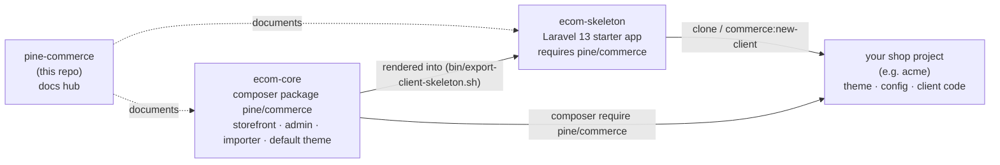

# Pine Commerce

**Pine Commerce** is an open-source e-commerce platform built on Laravel 13. It gives you a complete online shop
(storefront, checkout, back office, CMS and SEO) as a single Composer package, plus a ready-made starter app to put
it in. It is designed to replace WooCommerce shops like for like, and to run on ordinary shared hosting.

This repository is the **documentation hub**: what the platform is, how to get a store running, how to build themes
and how to add your own features. The code lives in two other repositories (see [Architecture](#architecture)).

- Core package: [SetWebUK/ecom-core](https://github.com/SetWebUK/ecom-core) (`pine/commerce`, latest release **v1.3.1**)
- Starter app: [SetWebUK/ecom-skeleton](https://github.com/SetWebUK/ecom-skeleton) (tag **v1.3.0**)
- Licence: MIT

---

## Contents

- [Who it is for](#who-it-is-for)
- [Features](#features)
- [Architecture](#architecture)
- [Requirements](#requirements)
- [Quick start (5 minutes)](#quick-start-5-minutes)
- [Guides](#guides)
- [Versioning and updates](#versioning-and-updates)
- [Licence](#licence)
- [Contributing](#contributing)

---

## Who it is for

| You are… | Pine Commerce gives you… |
|---|---|
| **An agency moving WooCommerce clients off WordPress** | A one-way, repeatable importer (products, variations, customers with their old passwords, orders, coupons, pages, posts, menus, redirects, SEO, media) that keeps every old URL working, and a theme system that can rebuild the old site pixel for pixel. |
| **A developer starting a new shop on Laravel** | A finished storefront and back office you can brand in an afternoon, with a clean extension API for anything bespoke. No admin framework to learn, no Node build. |
| **A shop owner** | A fast, straightforward back office: orders, products, customers, discounts, content, reports and one-click updates you approve yourself. |

## Features

**Catalogue** – simple and variable products, global attributes, categories, brands, shop filters (facets), search,
reviews, back-in-stock alerts, wishlists, related / up-sell / cross-sell products, product CSV import and export
(WooCommerce exports accepted).

**Basket and checkout** – side cart, guest or account checkout, coupons (percentage, fixed, free shipping), Stripe,
PayPal and bank transfer out of the box, more gateways through the extension API.

**Tax and shipping** – VAT / tax classes and rates (prices entered with or without tax), shipping zones with flat
rate, free shipping, weight or price bands and local pickup, shipping classes, custom shipping calculators.

**Orders** – full order management, refunds, notes, status emails, sequential invoice numbers, PDF invoices and
packing slips, abandoned-cart reminder emails, sales reports with CSV export.

**Customers** – accounts, addresses, order history, invoice downloads, staff roles (administrator, manager).

**Content (CMS)** – pages with a block-based page builder, blog with categories, menus, media library, redirects,
shortcodes, page templates.

**SEO** – titles, descriptions, canonicals, Open Graph, JSON-LD, XML sitemaps, robots.txt, Google Shopping feed,
WordPress-style URLs with trailing slashes so migrated URLs never change.

**Media** – automatic image sizes (WordPress-style file names) with WebP twins, `srcset`, `<picture>` output.

**Operations** – scheduled tasks that work with one cron line *or with no cron at all* (web fallback), a health check
(`commerce:doctor`), feature flags, and **Admin › Updates**: new releases are found automatically and installed only
after an administrator approves them, with a database backup and automatic rollback.

**Developers** – themes with child themes and a documented view contract, an extension API (`Pine\Commerce\Commerce::*`)
for gateways, shipping, admin pages, settings, widgets, page templates, shortcodes, scheduled tasks and importer
adapters, plus ordinary Laravel events.

**Stack** – Laravel 13, PHP 8.3+, plain Blade + Alpine.js + hand-written CSS (no Node, no build step), a hand-built
back office (no Filament, Livewire or Nova), MySQL / MariaDB (SQLite for local development and tests).

## Architecture

Pine Commerce is split across three public repositories, and each shop is its own Laravel project:



The same thing in plain text:

```
  pine-commerce (docs)          ecom-core (package)                 ecom-skeleton (starter)
  ────────────────────          ───────────────────────────────     ─────────────────────────
  README + guides       ──►     pine/commerce                ──►    Laravel 13 app with
                                  Pine\Commerce\…  (code)           "pine/commerce": "^1.3"
                                  resources/themes/default
                                  stubs/client-skeleton  ─── exported to ──┘
                                          │                                │
                                          │ composer                       │ git clone /
                                          ▼                                ▼ commerce:new-client
                                ┌──────────────────────────────────────────────────┐
                                │ Your shop project (one per shop, usually private)│
                                │   vendor/pine/commerce   ← never edited          │
                                │   themes/acme            ← your theme            │
                                │   config/commerce*.php   ← your config           │
                                │   app/Providers/ClientServiceProvider.php        │
                                │   app/Import/            ← importer adapters     │
                                └──────────────────────────────────────────────────┘
```

| Repository | What it is | You use it to… |
|---|---|---|
| **pine-commerce** (this one) | Documentation hub | learn the platform, onboard, find the right guide |
| **[ecom-core](https://github.com/SetWebUK/ecom-core)** | The platform itself: Composer package `pine/commerce`, namespace `Pine\Commerce` | install it in every shop; contribute fixes and features |
| **[ecom-skeleton](https://github.com/SetWebUK/ecom-skeleton)** | A ready Laravel 13 app that requires `pine/commerce` (generated from `ecom-core/stubs/client-skeleton`) | start a new shop |

The golden rule: **a shop never edits `vendor/pine/commerce`**. It configures, themes and extends the platform, so
platform updates keep arriving cleanly. Inside a shop, things are layered like this:

```
┌────────────────────────────────────────────────────────────────────┐
│ Shop project   .env · config/commerce*.php · App\… (provider, code) │
├────────────────────────────────────────────────────────────────────┤
│ Theme          themes/{slug}: views · assets · config · Theme.php   │
│                (child of another theme; the chain ends in default)  │
├────────────────────────────────────────────────────────────────────┤
│ Core           pine/commerce: schema, models, services, routes,     │
│                admin UI, emails, importer, commands, default theme  │
└────────────────────────────────────────────────────────────────────┘
```

## Requirements

| | |
|---|---|
| PHP | **8.3 or newer** (CLI and web) with `pdo_mysql` (or `pdo_sqlite`), `mbstring`, `intl`, `gd` or `imagick`, `curl`, `zip`, `bcmath`, `fileinfo`, `openssl`, `tokenizer`, `xml` |
| Database | MySQL 8 or MariaDB 10.6+ for staging and live; SQLite for local development and tests |
| Tools | Composer 2, Git. **No Node.js**, no queue worker, no Redis |
| Web server | Anything that can point the document root at `public/` (Apache, LiteSpeed, Nginx, cPanel/Plesk hosting) |
| Cron | Optional – one line runs every scheduled task; without it a web fallback runs them |

## Quick start (5 minutes)

This gets a working store on your machine with SQLite and PHP's built-in server.

```bash
# 1. Get the starter app and its dependencies
git clone https://github.com/SetWebUK/ecom-skeleton.git shop && cd shop
composer install

# 2. Environment
cp .env.example .env
php artisan key:generate
touch database/database.sqlite
```

Edit `.env` and change these four lines (use the **absolute** path to the SQLite file, and delete or ignore the other
`DB_*` lines):

```dotenv
DB_CONNECTION=sqlite
DB_DATABASE=/absolute/path/to/shop/database/database.sqlite
APP_URL=http://127.0.0.1:8000
SESSION_SECURE_COOKIE=false
```

```bash
# 3. Install: tables, first administrator, default settings, pages, menus, UK VAT rates, assets
php artisan commerce:install --admin-email=you@example.test --store-name="Demo Shop" --admin-password='choose-a-password'

# 4. Run it (from public/, using Laravel's router script)
cd public && php -S 127.0.0.1:8000 ../vendor/laravel/framework/src/Illuminate/Foundation/resources/server.php
```

Open <http://127.0.0.1:8000> for the shop and <http://127.0.0.1:8000/admin> for the back office.
(`php artisan serve` from the project root works too.)

Then run the health check in another terminal:

```bash
php artisan commerce:doctor
```

On a local http setup it is normal to see **FAIL APP_URL** (not https) and warnings for mail and payments. Enable
*Bank transfer* in **Admin › Settings › Payments** to place a test order.

Next: [Getting started](docs/01-getting-started.md) covers MySQL, hosting, cron and going live.

## Guides

| # | Guide | Read it when you want to… |
|---|---|---|
| 1 | [Getting started](docs/01-getting-started.md) | install a store (SQLite or MySQL), configure it, host it, go live |
| 2 | [Migrating from WooCommerce](docs/02-migrating-from-woocommerce.md) | move an existing WordPress/WooCommerce shop across, keeping URLs and SEO |
| 3 | [Themes and templating](docs/03-themes-and-templating.md) | brand the default theme, build a child theme or a bespoke like-for-like theme |
| 4 | [Building features](docs/04-building-features.md) | add payment gateways, shipping rules, admin pages, settings, scheduled jobs and more – without touching the core |
| 5 | [Admin guide](docs/05-admin-guide.md) | learn the back office (for shop managers) |
| 6 | [Updates and releases](docs/06-updates-and-releases.md) | keep shops up to date, or release a new platform version |
| 7 | [Contributing](docs/07-contributing.md) | work on the platform itself |
| – | [FAQ](docs/faq.md) | quick answers |

Full index: [docs/README.md](docs/README.md). The deep reference documentation lives with the code in
[ecom-core/docs](https://github.com/SetWebUK/ecom-core/tree/main/docs) – start with the
[Playbook](https://github.com/SetWebUK/ecom-core/blob/main/docs/PLAYBOOK.md).

## Versioning and updates

- `pine/commerce` follows **Semantic Versioning** with git tags `vX.Y.Z`. Patch = fixes, minor = additions that keep
  current behaviour, major = breaking changes to the public API (theme contract, config keys, extension API, events,
  importer interfaces, route names, database schema).
- Shops require a caret constraint (`"pine/commerce": "^1.3"`) and their `composer.lock` pins the exact version.
- **Admin › Updates** checks for new releases daily, shows the changelog with any *client actions required*, and
  installs a release only after an administrator approves it with their password: database backup, maintenance mode,
  `composer update`, migrations, asset publishing, health check, automatic rollback on failure. The same is available
  on the command line (`commerce:update:check`, `commerce:update:run`).
- Files a project received from the starter app can be updated separately when the project never changed them
  (`commerce:skeleton:check`).

Details: [Updates and releases](docs/06-updates-and-releases.md). History:
[CHANGELOG](https://github.com/SetWebUK/ecom-core/blob/main/CHANGELOG.md).

## Licence

Pine Commerce is open-source software licensed under the [MIT licence](LICENSE).
Copyright (c) 2026 SetWeb UK.

## Contributing

Bug reports, fixes, features and documentation improvements are welcome. Code changes go to
[ecom-core](https://github.com/SetWebUK/ecom-core); documentation changes for this hub come here. Read
[Contributing](docs/07-contributing.md) first – it explains the conventions (no admin frameworks, no Node build,
the package stays client-neutral) and how to report security issues privately.
